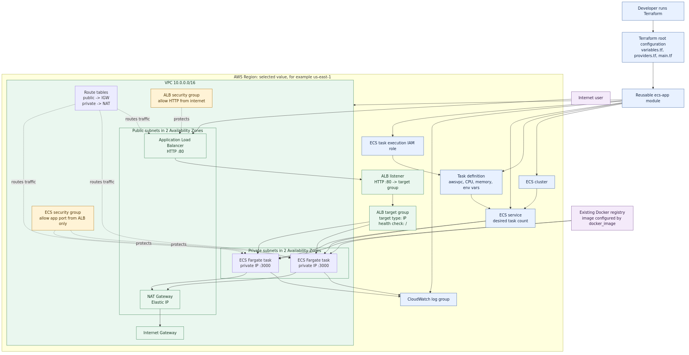

# CloudDock

CloudDock deploys an existing Docker image to AWS ECS Fargate behind an internet-facing HTTP Application Load Balancer (ALB). It does not build the image or assume a particular application language.

## Architecture and request flow



Each selected AWS region receives an independent copy of the stack:

```text
Internet
	|
	v
Public ALB :80
	|
	v
Target group (container port)
	|
	v
ECS Fargate tasks in private subnets
	|
	v
Docker image from an accessible registry
```

The Terraform module creates a VPC, two public and two private subnets in the first two available Availability Zones, route tables, an Internet Gateway, and one NAT Gateway. The ALB uses the public subnets. ECS tasks use private subnets with public IP assignment disabled, and use the NAT Gateway for outbound image and logging access.

The ALB security group permits HTTP traffic from the internet. The ECS security group permits the configured application port only from the ALB security group, so tasks are not directly exposed. ECS sends container output to a regional CloudWatch log group through its IAM execution role.

## Project structure

- `main.tf` creates the application module instance.
- `providers.tf` configures the AWS provider for the selected region.
- `variables.tf` defines the application inputs and validation rules.
- `outputs.tf` returns ALB DNS names and URLs keyed by region.
- `modules/ecs-app/` contains the reusable VPC, ALB, IAM, logging, and ECS resources.
- `terraform.tfvars.example` is a starting configuration.

## Configuration

Copy the example file and change the image and application settings:

```sh
cp terraform.tfvars.example terraform.tfvars
```

Important inputs are:

```hcl
regions = ["us-east-1"]

app_name       = "my-app"
docker_image   = "my-registry/my-app:latest"
container_port = 8080
cpu            = 256
memory         = 512
desired_count  = 2

environment_variables = {
  ENVIRONMENT = "production"
  LOG_LEVEL   = "INFO"
}
```

The image must already exist in a registry that ECS can access. For a private registry, configure the required AWS-side access separately; this project does not add application secrets or a registry integration.

## Execute

Prerequisites:

- Terraform `>= 1.3`
- AWS credentials configured for the target account
- Permission to create VPC, IAM, ALB, ECS, CloudWatch, and related resources

Run from this directory:

```sh
terraform init
terraform fmt -recursive
terraform validate
terraform plan
terraform apply
```

Review the plan before confirming `apply`. After deployment, Terraform prints:

- `alb_dns_names`: ALB DNS name for each region
- `application_urls`: HTTP URL for each region

To remove the stack later:

```sh
terraform destroy
```

## Region note

The configuration deploys one complete stack to the single region in `regions`. Change that value to any valid AWS region, such as `us-east-1`, and run Terraform again. Deploying to multiple regions simultaneously requires separate provider configurations and state management, so it is intentionally outside this small single-region entry point.